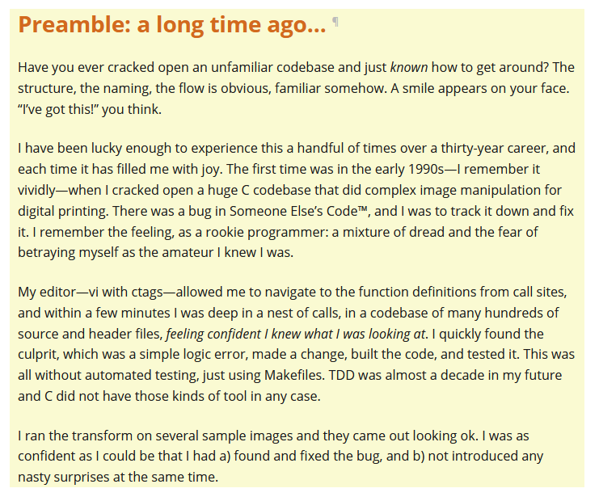

# CUPID - for joyful programming

## Whats possible

## Aim: Joyful coding
* The code guides you
* The code is easy to navigate
* The code is easy to reason
* The code gives confidence

## The iteration of thought

> “Any fool can write code that a computer can understand. Good programmers write code that humans can understand.”

—Refactoring, Martin Fowler with Kent Beck, 1996

BUT....

> “Habitability is the characteristic of source code that enables [people] to understand its construction and intentions and to change it comfortably and confidently.

> “Habitability makes a place liveable, like home.”

—Habitability and Piecemeal Growth1, Patterns of Software pp. 7-16, Richard P. Gabriel

